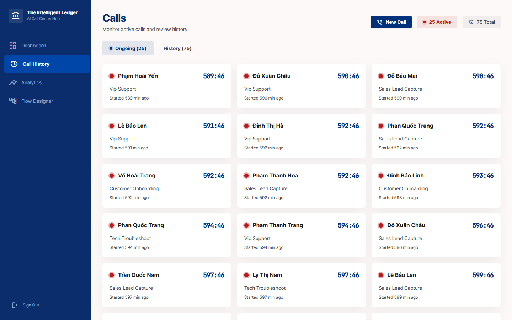
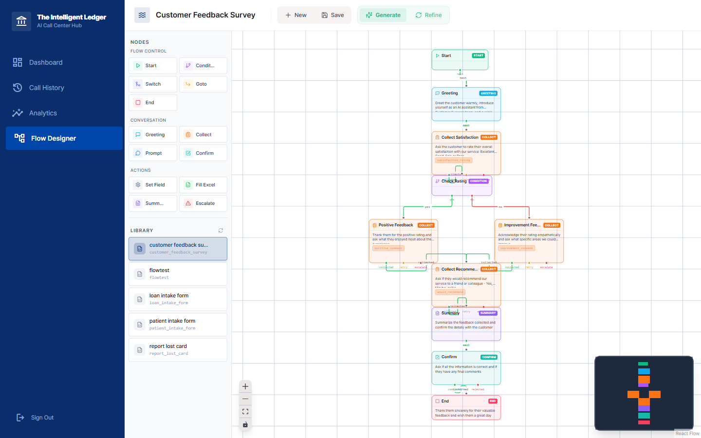
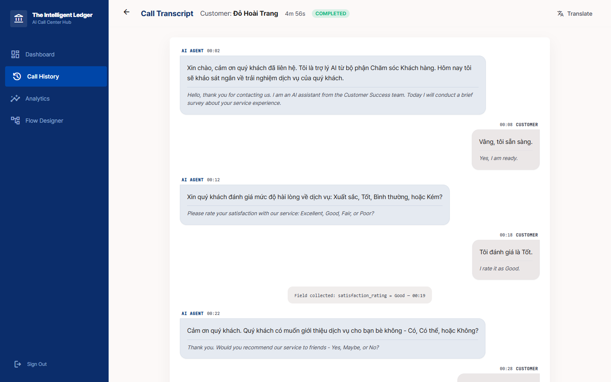
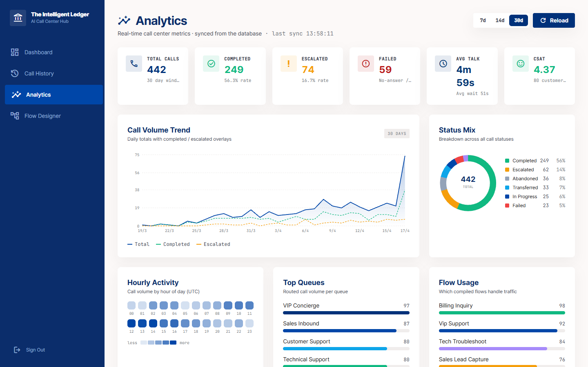

# Voice Form-Filling Agent

An AI-powered voice agent system that collects form data through natural conversation. Built with LiveKit Agents, Qwen LLMs, and a React-based dashboard for call center operations.

## Features

- **Voice-Based Form Collection**: Natural conversation flow to collect structured data (names, IDs, dates, etc.)
- **Real-Time Transcription**: Live speech-to-text with optional Vietnamese → English translation
- **Flow Designer**: Visual node editor to design conversation flows without coding
- **Call Center Dashboard**: Monitor ongoing calls, view transcripts, and manage escalations
- **Excel Export**: Automatically fill Excel templates with collected data
- **Human Escalation**: Seamless handoff to human operators with hold music
- **Phone Simulator**: Test flows with a browser-based phone interface

## Screenshots

### Call History
Monitor active calls and review history with real-time status updates.



### Flow Designer
Visual node-based editor to design conversation flows without coding.



### Call Transcript
View call transcripts with Vietnamese → English translation.



### Analytics Dashboard
Real-time call center metrics: volume trends, status breakdown, queue performance.



### Live Call with Escalation
Real-time transcript during active call with human escalation support.


## Tech Stack

### Backend
- **Python 3.11+** with async/await
- **LiveKit Agents** — Real-time voice communication
- **FastAPI** — REST API + SSE streaming
- **SQLAlchemy + aiosqlite** — Async database
- **Qwen** — LLM for conversation + flow compilation

### Frontend
- **React 18** with TypeScript
- **Vite** — Build tool
- **TailwindCSS** — Styling
- **XYFlow/React Flow** — Node-based flow editor
- **LiveKit Client** — WebRTC audio

## Prerequisites

- Python 3.11+
- Node.js 18+
- LiveKit Cloud account (or self-hosted server)
- OpenAI API key or Alibaba DashScope API key (for Qwen models)

## Installation

1. **Clone the repository**
   ```bash
   git clone https://github.com/your-org/voice-form-agent.git
   cd voice-form-agent
   ```

2. **Set up Python environment**
   ```bash
   python -m venv .venv
   source .venv/bin/activate  # On Windows: .venv\Scripts\activate
   pip install -r requirements.txt
   ```

3. **Set up frontend**
   ```bash
   cd frontend
   npm install
   cd ..
   ```

4. **Configure environment variables**
   ```bash
   cp .env.example .env
   # Edit .env with your credentials
   ```

## Environment Variables

```env
# LiveKit Configuration
LIVEKIT_URL=wss://your-project.livekit.cloud
LIVEKIT_API_KEY=your_api_key
LIVEKIT_API_SECRET=your_api_secret

# LLM Configuration (for flow compilation and conversation)
FLOW_DESIGNER_API_KEY=your_dashscope_key
FLOW_DESIGNER_BASE_URL=https://dashscope-intl.aliyuncs.com/compatible-mode/v1
FLOW_DESIGNER_MODEL=qwen3-max

# Translation (optional, for VI → EN)
DASHSCOPE_API_KEY=your_dashscope_key
QWEN_TRANSLATE_MODEL=qwen-mt-flash
QWEN_TRANSLATE_BASE_URL=https://dashscope.aliyuncs.com/compatible-mode/v1
```

## Running the Application

### Start All Services

```bash
# Terminal 1: Start the API server (includes LiveKit agent)
uvicorn api.main:app --reload --port 8000

# Terminal 2: Start the frontend
cd frontend && npm run dev
```

### Access Points

- **Dashboard**: http://localhost:5173
- **API**: http://localhost:8000
- **API Docs**: http://localhost:8000/docs

## Usage

### 1. Create a Flow

1. Open the Flow Designer at http://localhost:5173/flows
2. Click "New Flow" or upload an Excel template
3. Define fields (name, type, validation rules)
4. Save the flow

### 2. Test with Phone Simulator

1. Go to the Calls page (http://localhost:5173/calls)
2. Click "New Call" to start a simulated call
3. Grant microphone permission
4. Speak with the AI agent to fill the form

### 3. Compile a Flow

Flows are compiled automatically via the `/api/design` endpoint when generated through the Flow Designer. The compilation uses LLM to transform JSON flow definitions into optimized system prompts.

## API Endpoints

| Endpoint | Method | Description |
|----------|--------|-------------|
| `/api/flows` | GET | List all flows |
| `/api/flows/{id}` | GET/PUT/DELETE | Flow CRUD |
| `/api/design` | POST | Generate flow from fields |
| `/api/calls` | GET | List calls with pagination |
| `/api/calls/stream` | GET | SSE real-time call updates |
| `/api/calls/{id}` | GET/PATCH | Call details and updates |
| `/api/calls/{id}/end` | POST | End call + shutdown room |
| `/api/calls/{id}/transcript/stream` | GET | SSE transcript streaming |
| `/api/simulator/call` | POST | Create simulated call |
| `/api/translate` | POST | Translate text (VI → EN) |
| `/api/analytics` | GET | Dashboard analytics |

## Project Structure

```
├── api/
│   └── main.py                   # FastAPI application (REST + SSE)
├── core/
│   ├── agents/
│   │   ├── prompt_form_agent.py  # Main voice agent (LiveKit)
│   │   └── simple_agent.py       # Simplified agent variant
│   ├── compiler/
│   │   ├── flow_compiler.py      # JSON → compiled prompt (LLM)
│   │   └── models.py             # FieldSpec, CompiledFlowSpec
│   ├── db/
│   │   ├── base.py               # SQLAlchemy async setup
│   │   ├── models/               # ORM models (call, agent, customer, etc.)
│   │   └── seed_credits.py       # Database seeding
│   ├── designer/
│   │   └── flow_designer.py      # LLM-powered flow generation
│   ├── escalation/
│   │   └── human_stub.py         # Human operator handoff
│   ├── events/
│   │   ├── call_broadcaster.py       # Call status SSE
│   │   ├── form_broadcaster.py       # Form state SSE
│   │   ├── transcript_broadcaster.py # Transcript SSE
│   │   └── transcript_persister.py   # Transcript DB persistence
│   ├── excel/
│   │   ├── parser.py             # Excel template parsing
│   │   └── filler.py             # Excel output generation
│   ├── models/                   # Pydantic models (events, nodes, flow)
│   ├── providers_registry/
│   │   ├── stt/                  # Speech-to-text (GIPFormer)
│   │   └── tts/                  # Text-to-speech (Custom, gTTS)
│   ├── runtime/
│   │   └── validation.py         # Field validation engine
│   ├── store/
│   │   └── flow_store.py         # Flow persistence
│   └── translation/
│       ├── qwen_translator.py    # Qwen translation service
│       └── cache.py              # Translation caching
├── examples/
│   ├── flow_example.json         # Sample flow definition
│   ├── design_flow.py            # Flow design script
│   └── batch_phones.csv          # Batch call sample
├── frontend/
│   ├── src/
│   │   ├── pages/                # React pages
│   │   │   ├── Analytics.tsx         # Dashboard metrics
│   │   │   ├── CallsPage.tsx         # Call history/management
│   │   │   ├── CallTranscriptPage.tsx # Transcript viewer
│   │   │   ├── FlowDesigner.tsx      # Visual node editor
│   │   │   ├── LiveCallConsole.tsx   # Real-time call monitor
│   │   │   ├── OperatorJoin.tsx      # Human escalation join
│   │   │   └── PhoneSimulator.tsx    # Test phone interface
│   │   ├── components/           # Reusable UI components
│   │   ├── hooks/                # React hooks (LiveKit, SSE)
│   │   └── nodes/                # Flow node components
│   └── package.json
├── terraform/
│   ├── environments/             # dev, prod configurations
│   ├── modules/                  # compute, network, dns, lb
│   └── README.md
├── requirements.txt
└── start.sh                      # Quick start script
```

## Development

### Adding a New Field Type

1. Add the type to `core/models/field_defs.py`
2. Add validation logic to `core/runtime/validation.py`
3. Update the flow designer UI

### Creating Custom Flows

Flows are stored in the database and managed via the API. See `examples/flow_example.json` for the JSON structure:

```json
{
  "flow_id": "loan_intake_form",
  "name": "Loan Application",
  "nodes": [...],
  "edges": [...],
  "excel_config": {
    "template_path": "templates/loan_form.xlsx",
    "output_dir": "filled/"
  }
}
```

You can also design flows programmatically using `examples/design_flow.py`.

## Deployment

### LiveKit Cloud (Managed)

1. Create a project at https://cloud.livekit.io
2. Configure agent dispatch with name `form-agent`
3. Deploy the worker to your infrastructure

### Terraform (Self-Hosted on Alibaba Cloud)

Deploy a self-hosted LiveKit server on Alibaba Cloud ECS (Bangkok region) using Terraform.

#### Prerequisites

- Terraform >= 1.5.0
- Alibaba Cloud account with billing enabled
- SSH key pair

#### Quick Start

```bash
# 1. Set Alibaba Cloud credentials
export ALICLOUD_ACCESS_KEY="your-access-key-id"
export ALICLOUD_SECRET_KEY="your-access-key-secret"

# 2. Generate SSH key (if not exists)
ssh-keygen -t rsa -b 4096 -f ~/.ssh/livekit-key -N ""

# 3. Configure variables
cd terraform/environments/dev
cp terraform.tfvars.example terraform.tfvars
# Edit terraform.tfvars with your values

# 4. Deploy
terraform init
terraform plan
terraform apply
```

#### Example terraform.tfvars

```hcl
region              = "ap-southeast-7"      # Bangkok
environment         = "dev"
# domain_name       = ""                    # Leave empty for sslip.io (free)
livekit_api_key     = "APIxxxxxxxxxxxxx"    # Generate with: openssl rand -hex 16
livekit_api_secret  = "xxxxxxxxxxxxxxxx"    # Generate with: openssl rand -hex 32
instance_type       = "ecs.c7.xlarge"
ssh_public_key_path = "~/.ssh/livekit-key.pub"
```

#### Output

After deployment, Terraform outputs:
- `livekit_url` - WebSocket URL (e.g., `wss://livekit.47-95-1-2.sslip.io`)
- `eip_address` - Server public IP
- `ssh_command` - SSH access command

Update your `.env` with the `livekit_url` and credentials.

For detailed instructions, see [terraform/README.md](terraform/README.md).

## Troubleshooting

### Agent Not Responding

1. Check LiveKit connection: `LIVEKIT_URL`, `LIVEKIT_API_KEY`, `LIVEKIT_API_SECRET`
2. Verify API server is running: `uvicorn api.main:app --reload --port 8000`
3. Check browser microphone permissions

### Compilation Errors

1. Ensure LLM API credentials are valid
2. Check `FLOW_DESIGNER_*` environment variables
3. Review flow JSON structure

### Audio Issues

1. Ensure only one audio device is active
2. Check browser console for WebRTC errors
3. Try a different browser (Chrome recommended)

## License

MIT License

## Contributing

1. Fork the repository
2. Create a feature branch
3. Submit a pull request

For major changes, please open an issue first to discuss the proposed changes.
